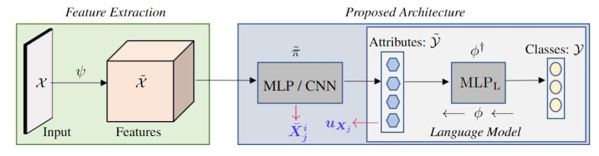
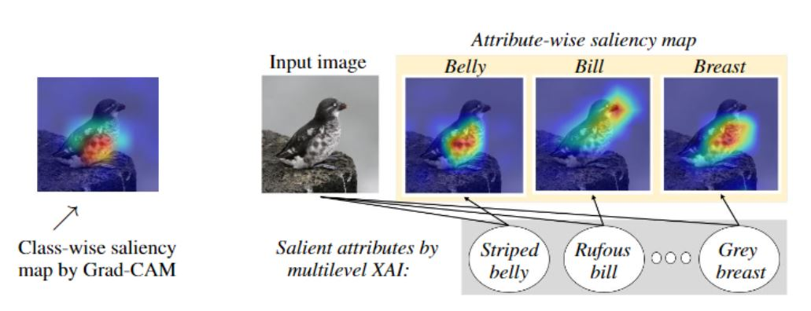
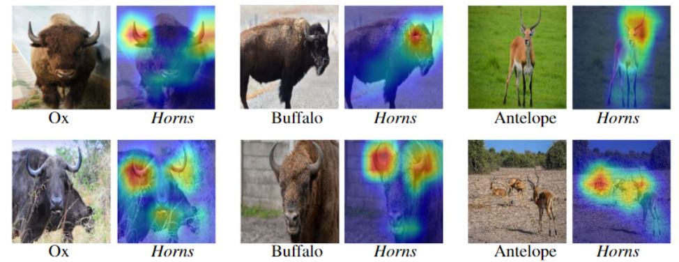

# Multilevel XAI
This repository contains the official implementation of Multilevel XAI paper submitted to ICLR 2023: https://iclr.cc/.

                                                       Proposed Architecture

                                                     Why is this a Least Auklet?

                                                         Where is Horn?

For AwA2 dataset, please visit: https://cvml.ist.ac.at/AwA2/

For CUB dataset, please see: https://authors.library.caltech.edu/27452/1/CUB_200_2011.pdf

                                                Full Attribute-Class Matrix

                                 

