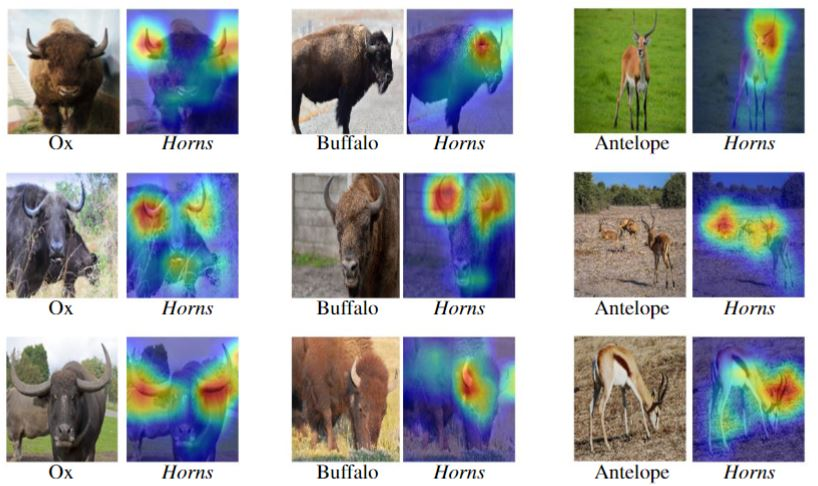

# Multilevel XAI
This repository contains the official implementation of Multilevel XAI paper submitted to Neurips 2022: https://neurips.cc/Conferences/2022.

                                                      Proposed Architecture

                                                     Why is this a Least Auklet?

                                                         Where is Horn?

For AwA2 dataset, please visit: https://cvml.ist.ac.at/AwA2/

For CUB dataset, please see: https://authors.library.caltech.edu/27452/1/CUB_200_2011.pdf
                                 

